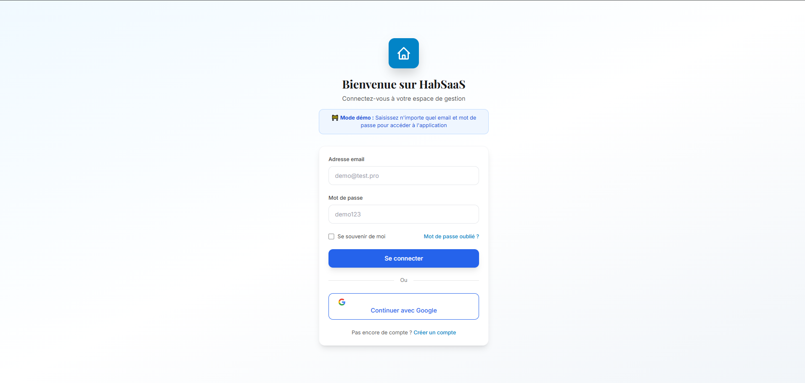
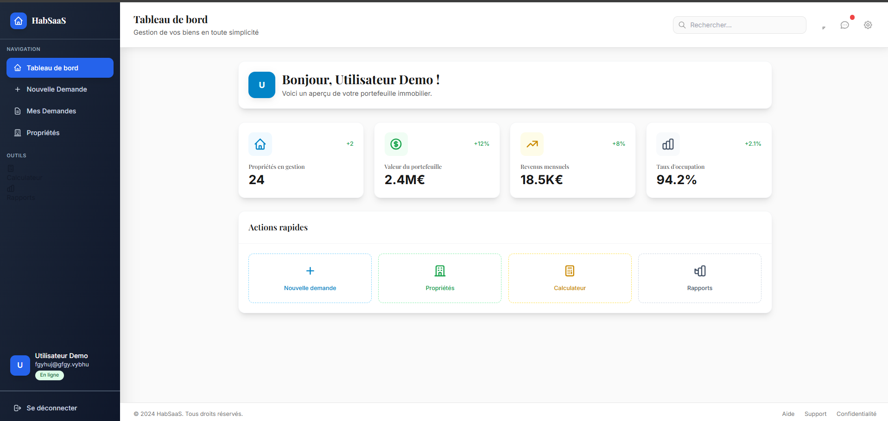

# 🏢 HabSaaS - Template SaaS

Un template moderne et prêt à l'emploi pour créer une application SaaS dans le domaine de la gestion que vous pourrez adapter selon le domaine. Ce projet propose une base solide avec authentification, interface utilisateur moderne et architecture modulaire.

## 📸 Aperçu de l'Interface

### Page de Connexion

*Interface de connexion moderne avec mode démo intégré*

### Tableau de Bord Principal

*Dashboard interactif avec statistiques et actions rapides*

## ✨ Fonctionnalités

### 🔐 Authentification
- **Système de connexion** avec formulaire et validation
- **Authentification Google** (simulation)
- **Gestion de session** avec localStorage
- **Routes protégées** avec redirection automatique
- **Mode démo** pour test instantané (aucune vérification backend)

### 🎨 Interface Utilisateur
- **Design system cohérent** adapté au domaine foncier
- **Sidebar de navigation** moderne avec animations
- **Dashboard interactif** avec statistiques et KPIs
- **Pages de gestion** des demandes et propriétés
- **Responsive design** pour tous les écrans

### 🏗️ Architecture
- **React 19** avec hooks modernes
- **React Router DOM v7** pour la navigation
- **Context API** pour la gestion d'état global
- **Composants modulaires** et réutilisables
- **TypeScript ready** (types inclus)

## 🚀 Démarrage Rapide

### Prérequis
- Node.js (version 18+)
- npm ou pnpm

### Installation

```bash
# Cloner ou télécharger le projet
cd WebSite

# Installer les dépendances
npm install

# Démarrer le serveur de développement
npm run dev
```

### Premier test
1. Ouvrez votre navigateur sur `http://localhost:5173`
2. Sur la page de connexion, saisissez n'importe quels identifiants :
   - Email : `demo@test.pro`
   - Mot de passe : `demo123`
3. Cliquez sur "Se connecter" pour accéder au dashboard

## 🛠️ Stack Technique

### Frontend
- **React 19.1.1** - Bibliothèque UI avec Fast Refresh
- **Vite 7.1.2** - Build tool ultra-rapide
- **React Router DOM 7.8.2** - Routage côté client
- **Tailwind CSS 3.4.15** - Framework CSS utility-first
- **PostCSS & Autoprefixer** - Optimisation CSS

### Développement
- **ESLint** - Linting et qualité de code
- **SWC** - Compilation ultra-rapide
- **HMR** - Hot Module Replacement

## 📁 Structure du Projet

```
src/
├── components/          # Composants réutilisables
│   ├── Layout.jsx       # Layout principal avec sidebar
│   ├── ProtectedRoute.jsx # Protection des routes
│   └── Sidebar.jsx      # Navigation latérale
├── context/             # Gestion d'état global
│   └── AuthContext.jsx  # Contexte d'authentification
├── pages/               # Pages de l'application
│   ├── DashboardPage.jsx # Tableau de bord principal
│   ├── LoginPage.jsx     # Page de connexion
│   ├── MyRequestsPage.jsx # Gestion des demandes
│   └── NewRequestPage.jsx # Nouvelle demande
├── App.jsx              # Composant racine
├── main.jsx             # Point d'entrée
└── index.css            # Styles globaux et Tailwind
```

## 🎨 Design System

### Palette de Couleurs
- **Primaire (Bleu)** : Actions principales et branding
- **Secondaire (Gris ardoise)** : Navigation et structure
- **Succès (Vert)** : États positifs et validations
- **Attention (Jaune)** : Alertes et éléments importants
- **Danger (Rouge)** : Erreurs et suppressions

### Typographie
- **Inter** : Police principale pour le contenu
- **Playfair Display** : Police serif pour les titres

### Composants Prêts
- Boutons (`.btn-primary`, `.btn-secondary`, `.btn-outline`)
- Cartes (`.card`, `.stat-card`)
- Champs de formulaire (`.input-field`)
- Badges de statut (`.badge-*`)

## 🔧 Scripts Disponibles

```bash
# Développement
npm run dev          # Serveur de développement
npm run build        # Build de production
npm run preview      # Prévisualisation de la build
npm run lint         # Vérification ESLint
```

## 📝 Utilisation comme Template

Ce projet est conçu pour être un point de départ pour vos applications SaaS :

1. **Clonez** le projet
2. **Personnalisez** les couleurs et le branding dans `tailwind.config.js`
3. **Modifiez** les composants selon vos besoins
4. **Intégrez** votre backend d'authentification dans `AuthContext.jsx`
5. **Ajoutez** vos fonctionnalités métier

## 🚀 Prochaines Étapes

Pour transformer ce template en application complète :

- [ ] Intégrer un backend d'authentification réel
- [ ] Ajouter une base de données
- [ ] Implémenter les formulaires multi-étapes
- [ ] Ajouter la gestion des fichiers/uploads
- [ ] Configurer les tests unitaires
- [ ] Mettre en place le déploiement

## 📄 Licence

Ce template est libre d'utilisation pour vos projets personnels et commerciaux.

---

**Développé avec ❤️ pour la communauté des développeurs SaaS**
